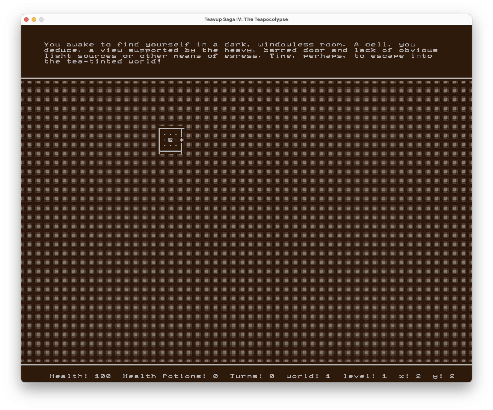

# Teapot-Saga-IV

In the next epic instalment to the Teapot Saga (trademark pending), take control of [playername], an adventurer destined to help
the Rebellion and save the world from the Teapocalypse, a cataclysmic, world-changing event instigated by Joe Soap, Avatar of the
Teanity. In a game somewhat similar to certain Roguelikes (minus the random generation in the main game), save the world from the
horrors of Tea.
Just remember, Fate dictates everything.

_By Olhcim & Deus-Mortuus._

## Media

**Starting Point**:
- All maps are revealsed byRaycasting through Fog
- Enemies pathfind towards the player with A-star (A*)

**World Map**:
- Progress tracker & safe zone
- Can re-visit past levels

**Final Boss**
- Multiple entities interacting, all minions need to be killed before boss can be damaged.

**Original photo during development in class**:
- Circa 2011/2012

